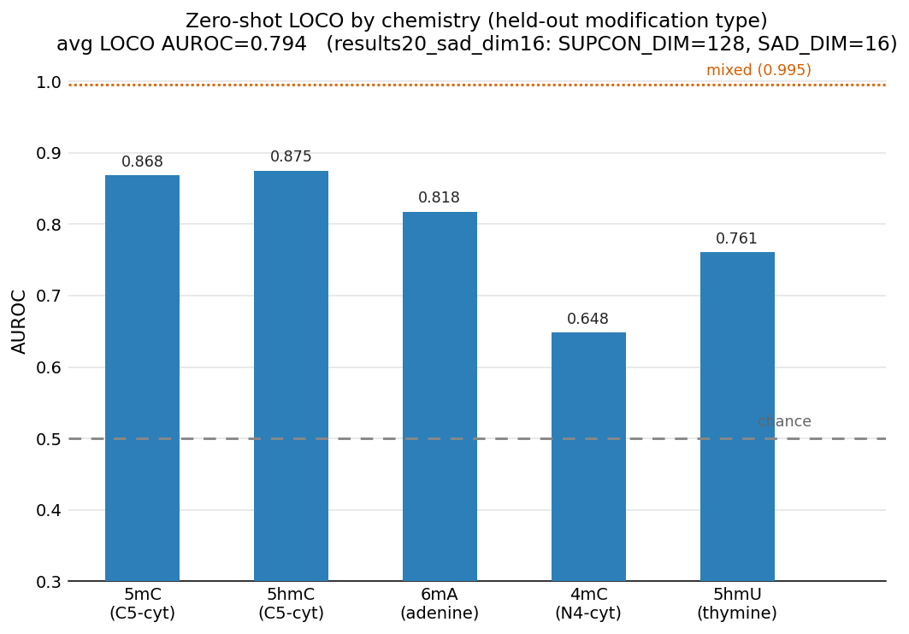

# RawMod

RawMod detects DNA base modifications from raw nanopore signal without being
told in advance which modification to look for. Reads are stacked into a
per-position pileup image and classified by a per-read convolutional trunk
followed by a cross-read transformer (`ConvFormerV2`, ~209K parameters),
trained with a paired supervised-contrastive objective on top of binary
cross-entropy.

## Status

A trained checkpoint is available (`checkpoints/results20_sad_dim16/`, see
"Pretrained checkpoint" below) and is the current best recipe. Training and
evaluation on additional external datasets are ongoing; this README documents
how to reproduce the pipeline and how to test the current checkpoint.

## Pretrained checkpoint

`checkpoints/results20_sad_dim16/` holds one `ConvFormerV2` checkpoint per
fold from the current best recipe (`SUPCON_DIM=128`, `SUPCON_TEMP=0.20`,
`SAD_DIM=16`, otherwise the leak-fixed recipe in "Training and evaluation"
below). `mixed.pt` is the general-purpose checkpoint — trained on all five
chemistries — and is the one to use for scoring new data (see "Scoring
external data"). The `loco_<CHEM>.pt` checkpoints hold out `CHEM` entirely
from training and exist to reproduce the zero-shot numbers below; they are
not general-purpose and should not be used to score `CHEM` sites in new data.

| Fold | AUROC | AUPRC | macro F1 | n_pos / n_test |
|---|---:|---:|---:|---:|
| `mixed` (in-distribution) | 0.995 | 0.999 | 0.958 | 39,028 / 51,423 |
| `loco_5mC` (zero-shot) | 0.868 | 0.687 | 0.780 | 1,174 / 4,049 |
| `loco_5hmC` (zero-shot) | 0.875 | 0.582 | 0.750 | 621 / 3,496 |
| `loco_6mA` (zero-shot) | 0.818 | 0.857 | 0.716 | 11,716 / 19,025 |
| `loco_4mC` (zero-shot) | 0.648 | 0.808 | 0.400 | 4,780 / 7,181 |
| `loco_5hmU` (zero-shot) | 0.761 | 0.929 | 0.576 | 4,658 / 5,707 |

Average zero-shot (`loco_*`) AUROC: 0.794. `auroc` is threshold-free and
comparable across folds; see "Training and evaluation" below for what the
other columns mean and their caveats (`loco_4mC`'s low macro F1 in particular
reflects a per-fold threshold choice, not the same generalization gap `auroc`
shows).



## Overview

The core design constraint is that a modification classifier trained on
motif-derived labels alone can simply memorize the recognition motif — e.g. a
model can score ~94% accuracy on Dam methylation by learning "GATC," never
looking at the signal. RawMod avoids this by training only on samples that
have a matched, genuinely unmodified counterpart at the same genomic
coordinate (synthetic control DNA, amplicon-stripped DNA, or
whole-genome-amplified DNA), so the label is causal rather than
sequence-derived, and by evaluating with leave-one-chemistry-out and
leave-one-organism-out splits so a reported score reflects generalization to
signal never seen during training, not memorization of a training-set motif.

Data artifacts (POD5, BAM, `features.h5`, checkpoints) are not stored in this
repository; all scripts reference them by absolute path on shared scratch
storage (see "Paths" below).

## Repository layout

```
rawmod/             core library: pileup featurization and the dataset/model/eval code
scripts/
  ground_truth/      motif-, bisulfite-, and pileup-derived ground truth; candidate-site generation
  featurize/         featurization entry points for the current pipeline
  train/             shared training/evaluation library, model architecture, and the training entry point
  test/              scoring entry points: built-in test folds and externally supplied site lists
analysis/            figure generation, diagnostics, and supplementary studies
archive/             superseded pipelines and alternative model recipes, kept for provenance
docs/                background reading
```

| Path | Contents |
|---|---|
| `rawmod/` | `featurization.py` builds pileup tensors from POD5/BAM/peaks; `model.py` provides `PileupDataset`, position-grouped data splits, and per-position evaluation. `lodo.py` and `visualization.py` are imported by `model.py`. |
| `scripts/ground_truth/` | Ground-truth extraction (motif-based, bisulfite/EM-seq, pileup-derived) and non-motif background-site generation. |
| `scripts/featurize/` | `refeaturize_strand15.py` (matched pool: ONT, SPO1, HP26695), `refeaturize_benchmark.py` (benchmark organisms and human), `featurize_background.py` (background negatives). |
| `scripts/train/` | `run_pipeline.py` (training loop, evaluation, metrics), `run_convformer_v2.py` (model architecture), `mod_types.py` (modification-chemistry typing), `run_matched_loco.py` / `run_matched_loco.sh` (the training and evaluation entry point). |
| `scripts/test/` | `score_genome.py` (score a checkpoint against an arbitrary `features.h5`), `test_external_sites.py` (score a checkpoint against an externally supplied site list, ground truth drawn from this repo's own GT bed). |
| `analysis/` | `orca_remake/` (embedding and clustering diagnostics), `denovo_motif_discovery/` (de novo motif rediscovery from a scored genome), `chem_diversity_sweep/` (training-diversity ablation), plus standalone plotting scripts. |
| `archive/` | `pipeline2/` (earlier all-genome mixed/LODO/LOMO study), `pipeline1_baseline/` (its Dorado baseline and evaluation scripts), `pipeline4_alternatives/` (DANN, Deep SVDD, and organism-adversarial recipe variants tried and superseded during model development). Not part of the current pipeline; kept for reproducibility of what was tried. |

## Paths

Scripts reference absolute scratch paths:

```
/fs/cbcb-lab/storm/bds062/data/benchmark/                       POD5 and references, benchmark organisms
/fs/cbcb-scratch/bds062/data/human/{hg001,hg002}/pod5/           POD5, human
/fs/cbcb-scratch/bds062/data/gt/                                 ground-truth BED files, all organisms
/fs/cbcb-scratch/bds062/results/benchmark_results/                     reads_refined.bam / peaks_refined.tsv
/fs/cbcb-scratch/bds062/results/rawmod_full_pipeline4/features/        features.h5 (matched pool, benchmark organisms, background sites)
/fs/cbcb-scratch/bds062/results/rawmod_matched_loco/                   run_matched_loco.py output: models/, metrics/
```

## Installation

```bash
git clone <this repository>
cd RawMod
pip install -e .
```

Requires Python 3.10+. Dependencies (`numpy`, `h5py`, `pod5`, `pysam`,
`torch`, `scikit-learn`, `matplotlib`, `tqdm`) are declared in
`pyproject.toml`. `pip install -e .` also installs `rawmod-featurize`,
`rawmod-train`, and `rawmod-visualize` as console commands.

## Reproducing the pipeline

### 1. Ground truth

Ground truth is derived independently of the nanopore signal being modeled:
motif-derived (Dam, Dcm, and related REBASE-characterized systems),
bisulfite/EM-seq (arabidopsis, hg001, hg002), or pre-computed bedMethyl.

```bash
python scripts/ground_truth/motif_gt.py --ref REF.fa.gz --preset ecoli_dam --outdir data/gt/Ecoli_DM
python scripts/ground_truth/extract_gt_bismark.py ...     # EM-seq / WGBS
python scripts/ground_truth/extract_gt_from_pileup.py ... # pre-computed bedMethyl
```

`motif_gt.py` writes `gt_modified.bed` (positive positions) and a
`candidate.bed` identical to it, which on its own makes a motif-derived
dataset entirely positive; see step 3 for how the matched-pool design and the
background-site step address this.

For each of the six motif-saturated bacterial benchmark organisms, generate
non-motif negative sites as well, used as test-only negatives for
`logo_bacteria` (step 4):

```bash
python scripts/ground_truth/generate_background_sites.py
```

### 2. Basecalling and refinement

```bash
bash scripts/ground_truth/submit_all.sh          # per-dataset table; invokes pipeline.sh
```

Runs Dorado basecalling and Remora move refinement, producing
`reads_refined.bam` and `peaks_refined.tsv` per dataset. This step runs once;
every featurization script below reuses its output and varies only
featurization parameters (window size, strand, read cap).

### 3. Featurization

Three scripts, one per data source, each producing `(16, 210, 9)` tensors — a
reference row plus 15 read rows, 21 window positions at 10 samples per base,
9 channels (`raw_signal, dwell_log1p, is_A, is_C, is_G, is_T, strand,
mapq_norm, matches_ref`). Pileups are forward-strand-only by construction; see
"Notes" below.

```bash
# ONT + SPO1/UMCES + HP26695 -- the matched pool. Each chemistry has a
# genuine unmodified counterpart at the same coordinate (synthetic control,
# amplicon-stripped, or whole-genome-amplified). 13 dataset files.
python scripts/featurize/refeaturize_strand15.py --dry-run
python scripts/featurize/refeaturize_strand15.py

# Seven benchmark organisms plus hg001/hg002 -- single-sample, no matched
# unmodified counterpart; used only as always-on curriculum data, never in
# the core LOCO test sets.
python scripts/featurize/refeaturize_benchmark.py --dry-run
python scripts/featurize/refeaturize_benchmark.py

# Non-motif background negatives for the six bacterial organisms (step 1),
# used only as test negatives for logo_bacteria.
python scripts/featurize/featurize_background.py --dry-run
python scripts/featurize/featurize_background.py
```

hg001/hg002 require `--sample-n-sites 300000` (set in
`refeaturize_benchmark.py`) and `--mem=192G`; their candidate pools are large
(hg001: 1.73M candidates).

### 4. Training and evaluation

Training and evaluation run in a single job per fold: each fold trains a
model, then immediately evaluates it on that fold's held-out test set and
writes `metrics/<fold>.tsv`. There is no separate evaluation-only mode for the
built-in folds; to score a checkpoint against data outside those folds, use
`scripts/test/score_genome.py` or `scripts/test/test_external_sites.py`.

```bash
FOLDS="mixed loco_5hmU loco_4mC loco_6mA loco_5mC loco_5hmC logo_bacteria logo_plant logo_mammal" \
OUTDIR=/fs/cbcb-scratch/bds062/results/rawmod_matched_loco/<results_dir> \
RAWMOD_DATA_GEN=strand15 \
EXTRA_ORGANISMS=1 \
INCLUDE_HUMAN=1 \
SUPCON_DIM=128 \
SUPCON_WEIGHT=1.0 \
SUPCON_TEMP=0.20 \
CURRICULUM=1 \
CURRICULUM_EPOCHS=15 \
SAD_DIM=16 \
SAD_WEIGHT=1.0 \
SAD_ETA=1.0 \
BCE_WEIGHT=1.0 \
bash scripts/train/run_matched_loco.sh
```

This is the recipe behind `checkpoints/results20_sad_dim16/` (see
"Pretrained checkpoint" above). `SAD_DIM=16` is the current recommendation —
a `SUPCON_DIM`/`SAD_DIM` sweep found it matched or beat every other setting
on average without the fold-specific instability larger `SAD_DIM` values
showed on the smallest fold (`loco_4mC`, confirmed by a replicate-seed rerun).
`--seed N` reruns training stochasticity only (weight init, dropout,
data-loader shuffling); it deliberately leaves the train/test split
(`SPLIT_SEED`, fixed at 42) unchanged, so a `--seed` replicate isolates
training noise from a genuinely different test set.

Each fold is submitted as an independent SLURM job (single GPU, streaming
from disk, `~7h` per fold on an RTX A5000) and runs in parallel subject to
cluster capacity. `TIME_LIMIT=HH:MM:SS` overrides the default 12-hour
wall-clock limit; `PARTITION=scavenger` and `GPU_TYPE=<model>` select an
alternate queue and GPU type — see the script header for the full list of
options. Pass `--dry-run` to inspect the generated `sbatch` commands without
submitting.

**Folds:**

- `mixed` — a position-grouped 85/15 split over the whole matched pool; the in-distribution reference point.
- `loco_<CHEM>`, `CHEM` in `5hmU, 4mC, 6mA, 5mC, 5hmC` — leave-one-chemistry-out. Trains on every chemistry except `CHEM` and evaluates zero-shot on `CHEM`. Also excludes any curriculum organism that carries `CHEM` under a different label (see `BENCH_ORG_CHEMS` in `run_matched_loco.py`); without this exclusion, three of the five chemistries leak back into training through the always-on benchmark-organism curriculum data (see "Notes").
- `logo_<group>`, `group` in `bacteria, plant, mammal` — leave-one-organism-group-out. Holds out an entire curriculum organism group from training and evaluates it zero-shot.
- `subset_<c1>+<c2>[+c3]` — a training-diversity sweep (2 to 4 of the 5 chemistries in training); see `analysis/chem_diversity_sweep/` and the module docstring in `run_matched_loco.py`. Supplementary; the chemistry-exclusion fix described above is not applied to this fold type, since a single trained model here is evaluated against multiple held-out chemistries at once.

Metrics columns (`metrics/<fold>.tsv`, one row per fold): `micro_f1, mod_f1,
unmod_f1, macro_f1, mod_prec, mod_rec, auprc, auroc, auroc_sad, threshold,
n_pos, n_test`. `auroc` is threshold-free and comparable across folds;
`mod_f1` and `macro_f1` are computed at a per-fold threshold that maximizes
F1 on that fold's own test labels (`run_pipeline.optimal_threshold`) and
should be read as a best-case operating point rather than compared directly
across folds with different test-set class balance. `n_pos` and `n_test` are
position-level counts: multiple pileup images at the same
`(file, contig, position)` are averaged into one row before scoring
(`rawmod/model.py:aggregate_by_position`), not raw image counts.

### 5. Scoring external data

Two ways to test the pretrained checkpoint (`checkpoints/results20_sad_dim16/mixed.pt`)
against data outside the built-in folds, depending on what you start from.

**From a site list** (contig/position pairs, e.g. a candidate BED from a motif
scan or another tool's calls) — this is the more common case, and the one
used for the external validations in `analysis/` (e.g. the E. coli and
Anabaena comparisons against Dorado):

```bash
python scripts/test/test_external_sites.py \
  --sites <tsv with contig, pos columns> \
  --pod5 <pod5 dir> --bam <reads_refined.bam> --peaks <peaks_refined.tsv> \
  --gt <ground-truth BED> \
  --checkpoint checkpoints/results20_sad_dim16/mixed.pt \
  --out-dir <output dir>
```

Ground truth is looked up from `--gt`, not from any label column the input
file may already carry — this matters when comparing against another tool's
own output, since that tool's calls should never be used as the label for
scoring itself. The script featurizes exactly the requested sites, scores
them with the checkpoint, and writes per-site scores and a metrics summary in
the same format as `run_matched_loco.py`.

**From an existing `features.h5`** (already featurized by this repo's own
pipeline, e.g. a benchmark organism's genome-wide pileup):

```bash
python scripts/test/score_genome.py \
  --h5 <features.h5> \
  --dataset <name> \
  --checkpoint checkpoints/results20_sad_dim16/mixed.pt \
  --out-dir <output dir>
```

`score_genome.py`'s default `--checkpoint` is the leave-one-dataset-out fold
matching `--dataset`, for a non-circularity guarantee when the organism the
h5 came from was in the training pool; pass `--checkpoint` explicitly (as
above) to use the general-purpose `mixed` checkpoint instead, e.g. when
scoring a genuinely external organism never in any training pool.

## Analysis

```bash
python analysis/make_reverse_complement_plots.py --out-dir <dir>
python analysis/visualize_h5_pileup.py --h5 features.h5 --cartoon
python analysis/orca_remake/recompute_bench_types.py --npz <embeddings_allorg.npz>
```

## Notes

**Strand handling.** An earlier pipeline (`archive/pipeline2/`) pooled both
strands into a single pileup; its reference row could then be built from
reads in the opposite orientation to its own read rows, so at 6mA sites the
reference row read approximately 50% A / 50% T although every 6mA is
genuinely on an A, and `matches_ref` was not meaningful wherever the
reference row happened to land on the other base. The current pipeline
avoids this by featurizing forward-strand-only (`--strand +`), so a pileup is
single-strand by construction and the reference-row ambiguity does not arise.
See `analysis/make_reverse_complement_plots.py` for the original measurement.

The current pipeline's own `--strand both` path (not this repo's convention,
but a supported option) carried a second, independent instance of the same
symptom until it was found and fixed during external validation against an
Anabaena REBASE-motif site set: `get_ref_info_from_bam()` reverse-complemented
the reference base for every reverse-mapped read, when pysam's
`get_aligned_pairs(with_seq=True)` already returns it in + strand orientation
regardless of read strand — so the complement was applied a second time,
corrupting base identity for roughly half of all reads whenever both strands
were pooled. This is now fixed (plain reversal, no complementing); `--strand
both` no longer needs to be avoided for this reason. All checkpoints in
`checkpoints/` were trained with `--strand +` throughout and were never
affected by this bug.

**Curriculum-data chemistry overlap.** The seven benchmark organisms and
hg001/hg002 are unioned into stage-2 training for every fold by default
(`EXTRA_ORGANISMS=1`, `INCLUDE_HUMAN=1`), and are not assigned a chemistry
label by the code that types the core matched pool. Several of these
organisms carry the same chemistry as a core-pool target under a name the
labeling code does not recognize: six of the seven bacterial/plant benchmark
organisms are Dam-like 6mA systems, two also carry 5mC, and one carries 4mC.
Left unaddressed, this allows a chemistry nominally held out by `loco_<CHEM>`
to still appear in training through the curriculum data, at a scale exceeding
the corresponding core-pool holdout. `BENCH_ORG_CHEMS` in `run_matched_loco.py`
records each organism's chemistry content and excludes any organism carrying
the held-out chemistry from training for the affected `loco_<CHEM>` folds.
5hmC and 5hmU are unaffected, since no curriculum organism carries either.
This exclusion is not applied to `subset_<...>` folds; see "Folds" above.
